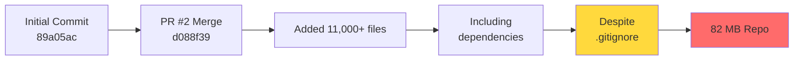

# 📊 Repository Bloat Analysis Summary
## Visual Overview for munaimtahir/radreport

---

## 🎯 The Problem at a Glance

```
Repository Size: 82 MB (should be ~5-10 MB)
Git Pack Size: 60.03 MiB
Bloat Factor: 8-16x larger than necessary
```

---

## 📈 Size Breakdown

```
┌─────────────────────────────────────────────────────────────┐
│                    REPOSITORY BLOAT SOURCES                  │
├─────────────────────────────────────────────────────────────┤
│                                                              │
│  backend/venv/          ████████████████████████ 135 MB     │
│                         8,372 files (60% of bloat)           │
│                                                              │
│  frontend/node_modules/ ████████████████ 77 MB              │
│                         2,484 files (35% of bloat)           │
│                                                              │
│  backend/staticfiles/   █ 3.3 MB                            │
│                         164 files (4% of bloat)              │
│                                                              │
│  backend/db.sqlite3     ▌ 508 KB                            │
│                         1 file (<1% of bloat)                │
│                                                              │
│  backend/media/         ▌ 2 KB                              │
│                         1 file (negligible)                  │
│                                                              │
└─────────────────────────────────────────────────────────────┘
```

---

## 🔍 Classification

```
┌──────────────────────┬──────────────────────────────────────┐
│   BLOAT TYPE         │   STATUS                             │
├──────────────────────┼──────────────────────────────────────┤
│ 🌳 Tree Bloat        │ ✅ YES - Files in current commit     │
│ 📚 History Bloat     │ ✅ YES - Files in Git history        │
│ 🏷️  Classification   │ ⚠️  BOTH (requires two-phase fix)   │
└──────────────────────┴──────────────────────────────────────┘
```

---

## 🎭 The Story: How Did This Happen?



**Timeline:**
1. ✅ Repository created (89a05ac)
2. ⚠️  PR #2: "Production Docker deployment" merged (d088f39)
3. ❌ Massive import: 11,000+ files added including venv/ and node_modules/
4. ⚠️  .gitignore existed with correct patterns but was overridden
5. 💥 Result: 82 MB bloated repository

---

## 🔧 Fix Options Comparison

```
┌────────────────┬──────────────┬────────────────┬─────────────┐
│   APPROACH     │   TIME       │   RISK         │   RESULT    │
├────────────────┼──────────────┼────────────────┼─────────────┤
│ Quick Fix      │ 30 minutes   │ 🟢 Low         │ Tree clean  │
│ (Phase 1)      │              │ No force-push  │ History +   │
│                │              │ Safe for team  │             │
├────────────────┼──────────────┼────────────────┼─────────────┤
│ Complete Fix   │ 2-4 hours    │ 🟡 Medium      │ Full clean  │
│ (Phase 1+2)    │              │ Force-push     │ 5-10 MB     │
│                │              │ Team re-clone  │             │
└────────────────┴──────────────┴────────────────┴─────────────┘
```

---

## 🚀 Quick Fix (Phase 1) - Safe & Fast

**What it does:** Removes files from current tree, prevents future bloat

```bash
# Remove the bloat
git rm -r backend/venv/ frontend/node_modules/ backend/staticfiles/
git rm backend/db.sqlite3
git commit -m "Remove dependency directories and build artifacts"
git push
```

**Impact:**
- ✅ New commits are clean
- ✅ No force-push needed
- ✅ Safe for all collaborators
- ❌ History still contains bloat (clone still ~60 MB)

**Time:** 30 minutes  
**Risk:** 🟢 Low  
**Recommended:** Yes, do this first

---

## 💪 Complete Fix (Phase 2) - Optimal

**What it does:** Removes files from entire Git history

```bash
# Install tool
pip install git-filter-repo

# Fresh clone and filter
git clone https://github.com/munaimtahir/radreport.git radreport-filter
cd radreport-filter
echo "backend/venv/
frontend/node_modules/
backend/staticfiles/
backend/db.sqlite3
backend/media/pdfs/" > paths-to-remove.txt

git-filter-repo --invert-paths --paths-from-file paths-to-remove.txt --force

# Force push
git remote add origin https://github.com/munaimtahir/radreport.git
git push origin --force --all
git push origin --force --tags
```

**Impact:**
- ✅ Repository: 82 MB → 5-10 MB (85-90% reduction)
- ✅ Faster clones and operations
- ⚠️  All collaborators must re-clone
- ⚠️  Breaks existing PRs (need rebase)

**Time:** 2-4 hours (including coordination)  
**Risk:** 🟡 Medium  
**Recommended:** Yes, after Phase 1 and team coordination

---

## 📋 Verification Checklist

### After Phase 1 (Quick Fix)
```
□ git status shows clean working tree
□ git ls-files | grep venv returns nothing
□ git ls-files | grep node_modules returns nothing
□ Backend runs: pip install -r requirements.txt && python manage.py runserver
□ Frontend runs: npm install && npm run dev
□ README includes setup instructions
```

### After Phase 2 (Complete Fix)
```
□ git count-objects -vH shows size-pack < 10 MiB
□ git log --all | grep venv returns nothing
□ GitHub shows reduced size (may take 24-48 hours)
□ All collaborators notified
□ All collaborators have re-cloned
□ CI/CD systems updated and working
```

---

## 🎯 Expected Results

```
┌─────────────────────┬──────────┬──────────┬────────────┐
│      METRIC         │  BEFORE  │  AFTER   │ IMPROVEMENT │
├─────────────────────┼──────────┼──────────┼─────────────┤
│ Git Pack Size       │  60 MB   │  5-10 MB │   85-90%    │
│ Clone Time          │  ~30s    │   ~5s    │   83%       │
│ Tracked Files       │  14,207  │  ~3,000  │   79%       │
│ Working Tree (fresh)│  258 MB  │  88 KB   │   99.9%     │
└─────────────────────┴──────────┴──────────┴─────────────┘
```

---

## 🛡️ Prevention Strategy

### Rule 1: Never Commit These
```
❌ backend/venv/              Python virtual environment
❌ frontend/node_modules/     Node.js dependencies
❌ backend/staticfiles/       Django collected static files
❌ backend/db.sqlite3         SQLite database
❌ backend/media/pdfs/        Generated PDFs
❌ .vscode/                   IDE configurations
```

### Rule 2: Always Check Before Committing
```bash
git status
git diff --cached

# If you see venv/ or node_modules/, STOP! 🛑
# Something is wrong with your .gitignore
```

### Rule 3: Use Pre-commit Hooks (Optional)
```bash
pip install pre-commit
# Configure to check file sizes and forbidden paths
pre-commit install
```

---

## 📚 Documentation Files

All comprehensive documentation has been created:

```
📄 REPOSITORY_BLOAT_DIAGNOSTIC.md (611 lines)
   → Complete analysis with evidence and technical details
   
📄 CLEANUP_INSTRUCTIONS.md (653 lines)
   → Step-by-step procedures for both phases
   → Troubleshooting guide
   → Rollback procedures
   
📄 QUICK_REFERENCE.md (250 lines)
   → TL;DR summary
   → Decision matrix
   → Key commands
   
📄 PROPOSED_GITIGNORE.txt (356 lines)
   → Enhanced .gitignore template
   → Comprehensive patterns
   → Well-commented sections

📄 VISUAL_SUMMARY.md (this file)
   → Quick visual overview
   → Charts and diagrams
```

---

## 🎬 Action Items

### Immediate (This Week)
1. ✅ Review diagnostic report: `REPOSITORY_BLOAT_DIAGNOSTIC.md`
2. ⬜ Choose fix approach based on team situation
3. ⬜ Execute Phase 1 (Quick Fix) - safe for everyone
4. ⬜ Test that development environment still works

### Short Term (Next 2 Weeks)
5. ⬜ Coordinate with team for Phase 2 timing
6. ⬜ Backup repository before Phase 2
7. ⬜ Execute Phase 2 (Complete Fix) during quiet period
8. ⬜ Verify repository size reduction

### Long Term (Ongoing)
9. ⬜ Apply enhanced .gitignore
10. ⬜ Set up pre-commit hooks (optional)
11. ⬜ Add CI/CD checks for file sizes
12. ⬜ Educate team on Git best practices

---

## 🆘 Need Help?

### Quick Questions?
→ Check `QUICK_REFERENCE.md`

### Step-by-Step Guide?
→ Follow `CLEANUP_INSTRUCTIONS.md`

### Technical Details?
→ Read `REPOSITORY_BLOAT_DIAGNOSTIC.md`

### Something Broke?
→ See "Troubleshooting" section in `CLEANUP_INSTRUCTIONS.md`

---

## 📊 Success Metrics

After completing all fixes, you should see:

```
✅ Repository clones in ~5 seconds instead of ~30 seconds
✅ Git operations (fetch, pull, push) are noticeably faster
✅ New developers can get started quickly
✅ No accidental dependency commits in future
✅ Repository follows Git best practices
✅ Team is educated on what not to commit
```

---

## 🎓 Key Learnings

1. **Dependencies Don't Belong in Git**
   - Virtual environments: `venv/`, `.venv/`
   - Package managers: `node_modules/`, `vendor/`
   - Use: `requirements.txt`, `package.json` instead

2. **Build Artifacts Don't Belong in Git**
   - Generated files: `dist/`, `build/`, `staticfiles/`
   - Can be regenerated: `npm run build`, `collectstatic`

3. **User Data Don't Belong in Git**
   - Databases: `db.sqlite3`, `*.db`
   - Uploads: `media/`, `uploads/`
   - Use: Environment-specific storage instead

4. **Always Review Before Committing**
   - Use: `git status`, `git diff --cached`
   - Check: File sizes and paths
   - Question: "Should this be in version control?"

---

## 🏆 Bottom Line

**Problem:** 82 MB repository (8-16x too large)  
**Cause:** Dependencies and build artifacts committed to Git  
**Solution:** Two-phase cleanup (remove from tree + history)  
**Result:** 5-10 MB repository (85-90% reduction)  
**Time:** 30 minutes (Phase 1) + 2-4 hours (Phase 2)  
**Risk:** Low (Phase 1), Medium (Phase 2)  
**Recommendation:** ✅ Do Phase 1 now, Phase 2 after coordination

---

**Analysis Date:** January 7, 2026  
**Repository:** munaimtahir/radreport  
**Branch:** copilot/diagnose-repo-bloat-sources  
**Status:** ✅ Diagnostic Complete - Ready for Cleanup
